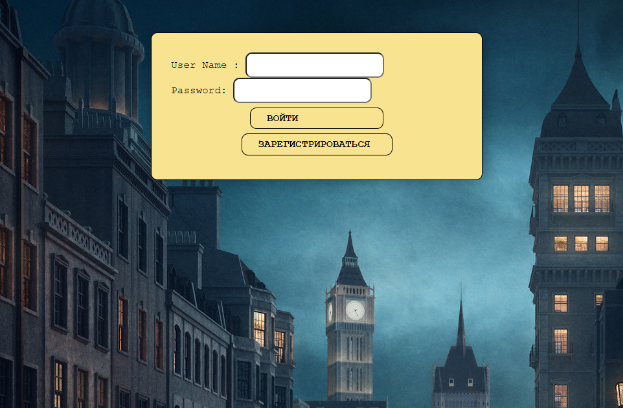
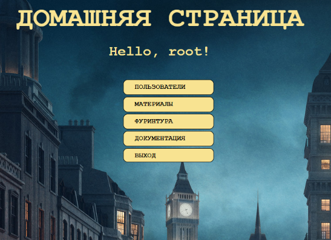
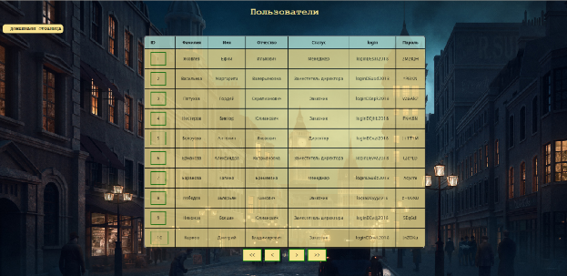

# Furniture firm
## Simple spring boot app

</br>

Веб приложение предполагает взаимодействие с базой
данных, содержащей информацию о некой мебельной
фирме(активные пользователи, материалы, фурнитура).
Приложение реализует CRUD операции(create, read,
update, delete).

## Backend-часть проекта
</br>
Для взаимодействия с базой данных применяется `Hibernate API`. Дамп
применяемой базы данных : `...\FurnitureFirmApp\dbdump.dump`.

## Frontend-часть проекта
</br>
Чётко выраженная frontend-часть у проекта отсутствует. Вместо нее
применяется шаблонизатор `Thymeleaf`.

## Разграничение доступа
Для ограничения доступа неавторизованных пользователей, а также
разграничения прав авторизованны пользователей применяется Spring Security.

## Ajax
Ajax запросы у приложения отсутствуют.

## Документация

У проекта имеется javadoc.

## Запуск проекта
</br>
Так как у проекта есть POM, он может быть запущен с помощью
Maven из командной строки
```
...\FurnitureFirmApp>mvn spring-boot:run
```
Также проект может быть запущен с помощью IntellijIDEA прямо
из класса Spring boot приложения:
```
@SpringBootApplication
public class FurnitureFirmSpringBootApplication {
    public static void main(String[] args) {
        SpringApplication.run(FurnitureFirmSpringBootApplication.class, args);
    }
}
```
При запуске необходимо убедиться, что запущен mysqld, а параметры
для взаимодействия backend-части с БД в конфигурационном файле
`...\FurnitureFirmApp\src\main\resources\application.properties`
настроены в соответствии с параметрами местного mysqld.</br>
1. spring.datasource.url=jdbc:mysql://${MYSQL_HOST:localhost}:3306/
`Your mysql database name`?useUnicode=true&useJDBCCompliantTimezoneShift=true&use
LegacyDatetimeCode=false&serverTimezone=UTC
2. spring.datasource.username=`Your mysql user name`
3. spring.datasource.password=`Your mysql user password`
4. spring.jpa.database-platform=org.hibernate.dialect.MySQL`Your mysql version`Dialect

После старта проекта, обратиться к нему можно по адресу
`http://localhost:8080`

Профиль пользователя, наделенного всеми возможными правами:
1. User Name: `root`
2. Password: `root`

## Пользовательские страницы
### Страница регистрации

### Страница авторизации

### Домашняя страница

### Страница пользователей

### Страница материалов

### Страница фурнитуры

### Страница пользователя

### Страница обновления пользователя

### Страница документации
